# 🍔 BiteRush – Food Ordering Web App

A modern, responsive food ordering web application built with a focus on clean UI, fast user experience, and scalable frontend architecture.

---

## 🚀 Live Demo

⚠️ Note: This app uses the Swiggy Live API. Due to CORS restrictions, it may require a CORS-enabled browser extension to fetch real-time data locally.

https://food-ordering-app-2d4cd.web.app/

---

## 📸 Live Preview


## 📸 Screenshots

### 🏠 Home Page

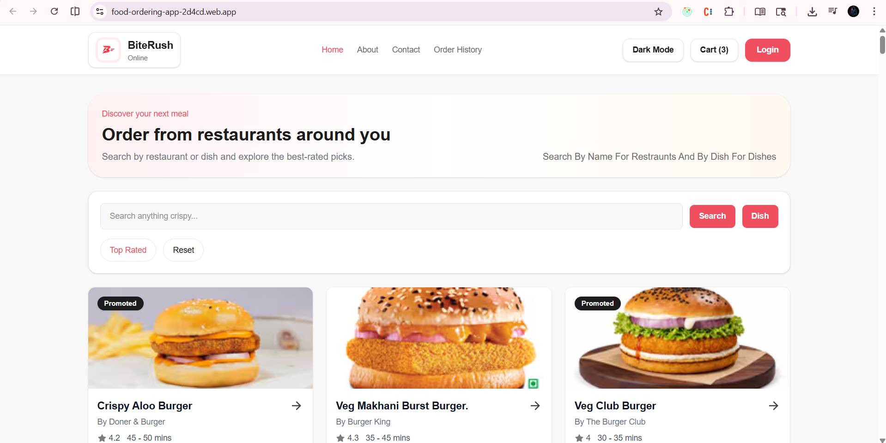
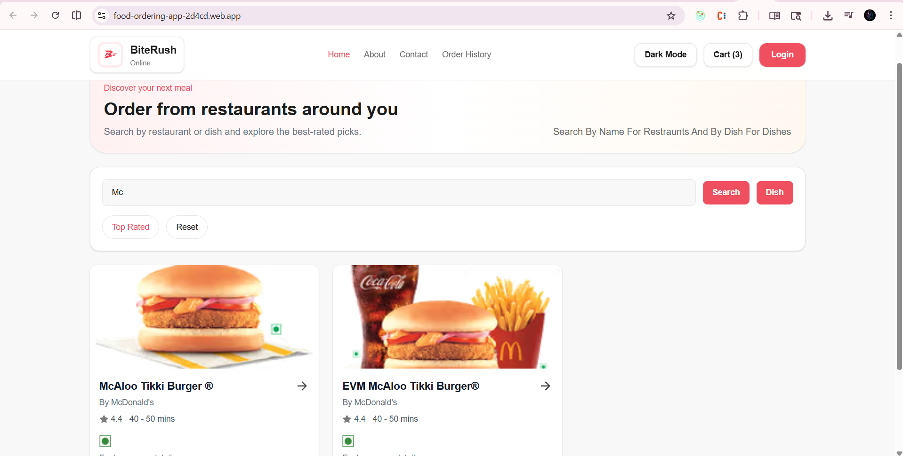
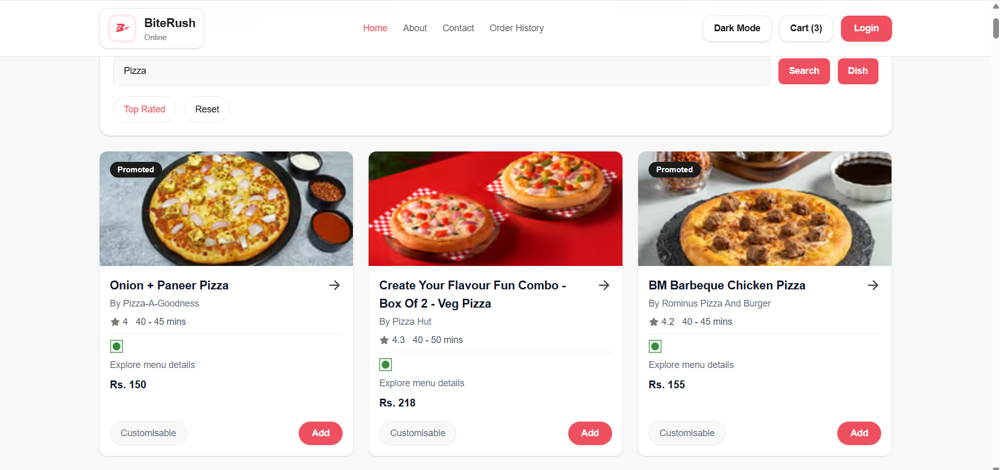
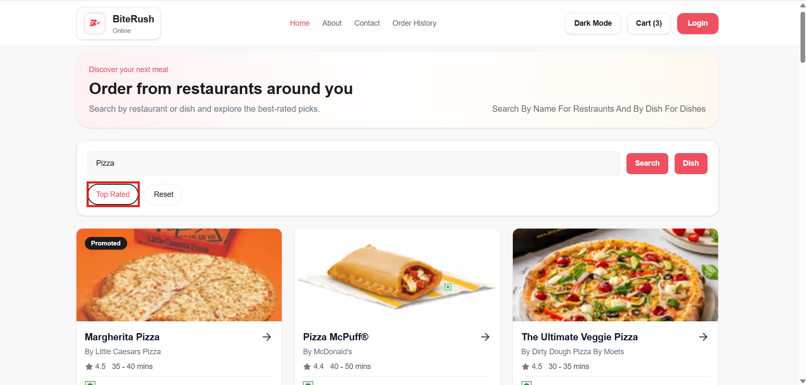

### 🍽️ Menu Page

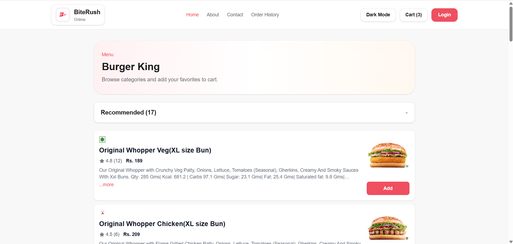
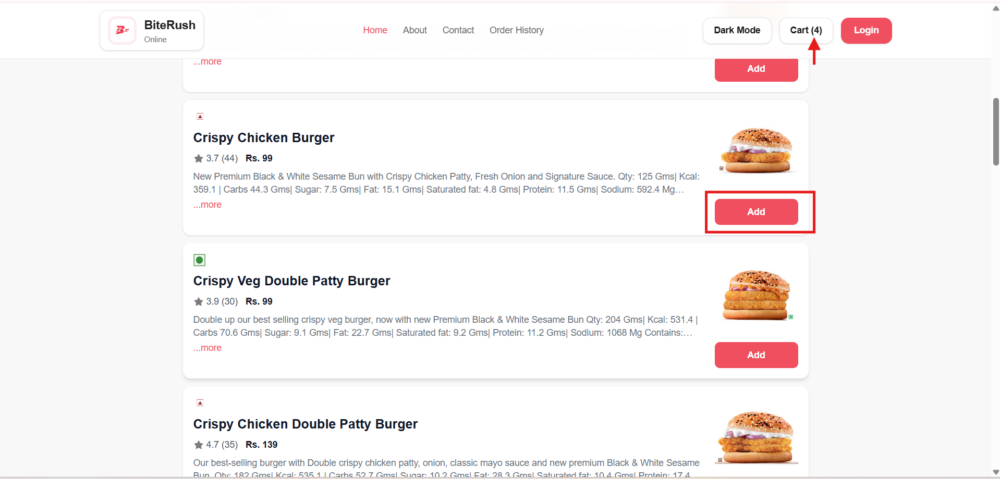

### 🛒 Cart Page

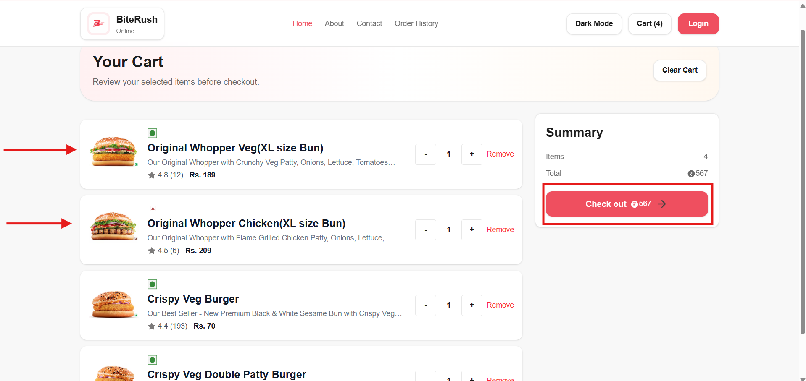

### 💳 Checkout Page

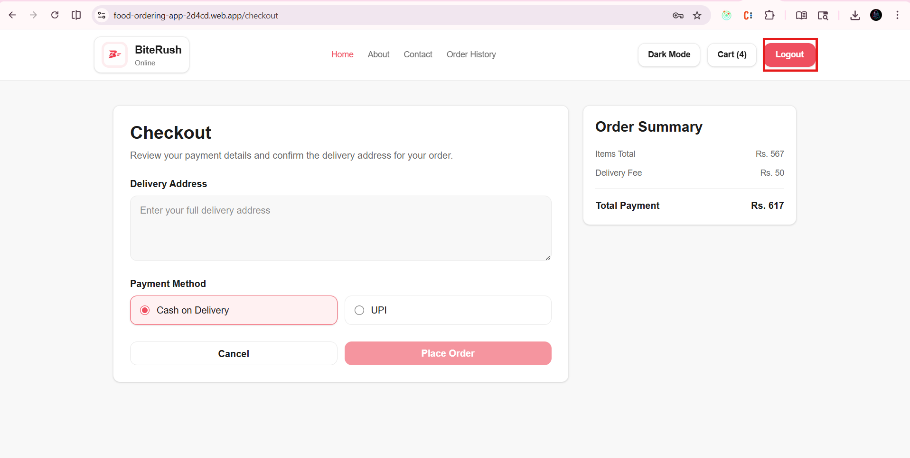
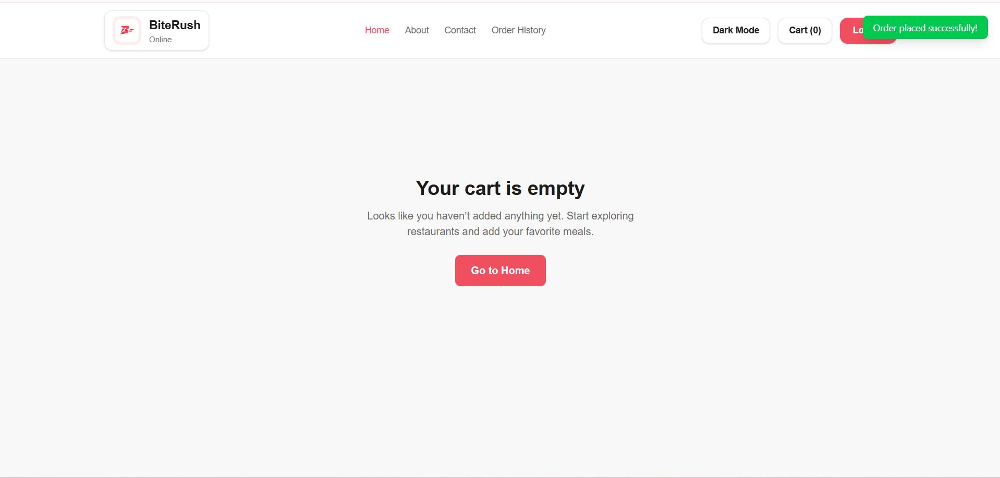

### 📜 Order History

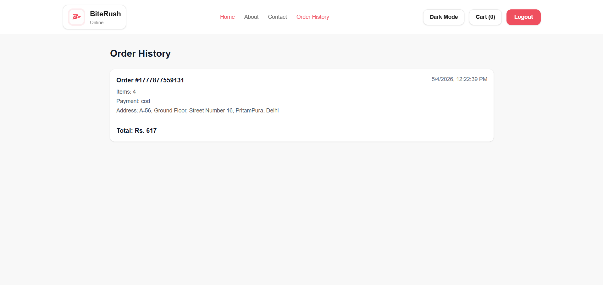

### 🔐 Login / Authentication

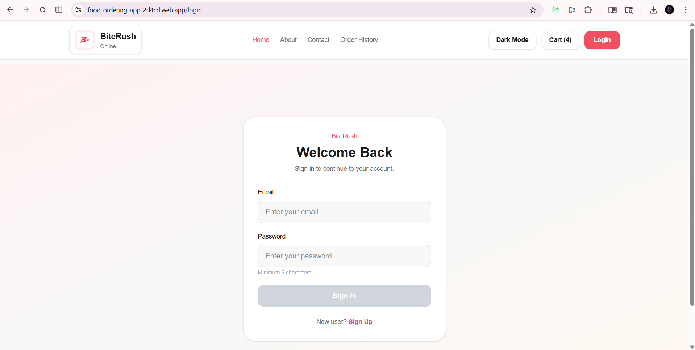

### 🌙 Dark Mode

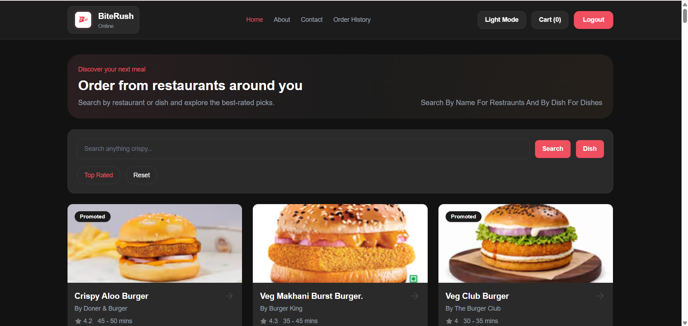

---

## ✨ Features

- 🔍 Search restaurants by name
- ⭐ Filter top-rated restaurants
- 🛒 Add / remove items from cart
- 💾 Persistent cart using local storage
- 🔐 User authentication (Firebase)
- 🚫 Protected routes
- 📦 Order history tracking
- 🌙 Dark / Light mode toggle
- ⚡ Toast notifications for user feedback
- 📱 Fully responsive (mobile-first design)

---

## ⚙️ Tech Stack

- **Frontend:** React
- **State Management:** Redux Toolkit
- **Routing:** React Router
- **Styling:** Tailwind CSS
- **Authentication:** Firebase Auth
- **API:** Swiggy Live API
- **State Persistence:** Local Storage

---

## 🧠 Learnings

- Managing complex state using **Redux Toolkit**
- Handling **async data fetching** and API integration
- Implementing **authentication & protected routes**
- Designing **scalable and reusable UI components**
- Building a **consistent UI system with Tailwind CSS**
- Implementing **dark mode using global state (Redux)**
- Creating **responsive layouts (mobile-first approach)**

---

## 🏗️ Project Structure

```
src/
 ├── components/
 ├── utils/
 │    ├── Redux/
 │    ├── assets/
 │    └── custom hooks
 ├── App.js
```

---

## 🛠️ Installation & Setup

Clone the repository:

```
git clone <your-repo-link>
```

Install dependencies:

```
npm install
```

Run the app:

```
npm start
```

---

## 🔮 Future Improvements

- 💳 Payment gateway integration
- 🌐 Real backend instead of static menu
- 🧪 Unit & integration testing (Jest + RTL)
- ⚡ Performance optimization & lazy loading

---

## 📬 Contact

- **LinkedIn:** www.linkedin.com/in/dharmeet-singh-gulati-4109852b1
- **GitHub:** https://github.com/Dharmeet-Singh-Gulati

---
